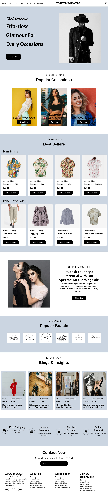

# 🛍️ E-commerce Website

<p align="center">
  
</p>

## Project Overview
A dynamic **e-commerce platform** offering a seamless online shopping experience. This website features **light and dark themes**, along with interactive product displays, providing users with a visually engaging shopping experience across devices.

---

## 🚀 Features

- **Dynamic Product Rendering**: Products are dynamically loaded and displayed from the backend, ensuring updated listings without page reloads.
- **Responsive Design**: Optimized for mobile, tablet, and desktop for a consistent user experience.
- **User Authentication**: Secure login and account creation for personalized shopping.
- **Product Categories**: Easy navigation with well-organized product categories.
- **Shopping Cart**: Add products to your cart for easy access and management.
- **Streamlined Checkout**: Simplified and secure process to complete purchases quickly.
- **Light and Dark Themes**: Users can switch between light and dark modes for their preferred viewing experience.
- **Contact Form**: Allows users to reach out with inquiries or feedback.

---

## 🛠️ Technologies Used

- **HTML**: Structure and content of the website.
- **CSS**: Styling and theme management (light/dark modes).
- **JavaScript**: Interactive elements, dynamic product rendering, and theme toggling.
- **Bootstrap**: Ensures responsive design and easy component integration.
- **Font Awesome**: Icon support for an enhanced UI.

---

## 📸 Preview

<p align="center">
  
  <br>
  <em>Home page showcasing dynamically rendered products</em>
</p>

<p align="center">
  
  <br>
  <em>Product details page with more information</em>
</p>

<p align="center">
  
  <br>
  <em>Shopping cart view displaying selected items</em>
</p>

---

## 🌐 Live Demo

Check out the live website: [E-commerce Website](https://hrjayasuryasingh9.github.io/FrontEnd/E-commerce%20website/)

---

## 📋 How to Get Started

To clone the project and run it locally:

```bash
git clone https://github.com/hrjayasuryasingh9/FrontEnd.git
