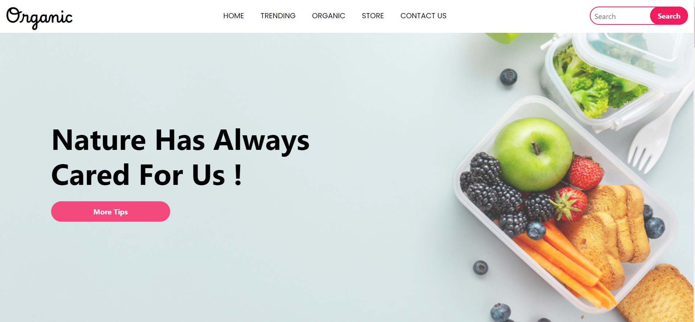

<!-- Project Title -->
<h1 align="center">Organic Products Website</h1>

<!-- Project Description -->
<p align="center">
  A website showcasing various organic products, promoting a healthy lifestyle.
</p>

<!-- Preview Image -->
<p align="center">
  
</p>

<!-- Badges -->
<p align="center">
  <a href="https://github.com/hrjayasuryasingh9/FrontEnd/blob/master/LICENSE">
    
  </a>
  <a href="https://github.com/hrjayasuryasingh9/FrontEnd/stargazers">
    
  </a>
</p>

<!-- Features -->
## Features

- **Responsive Design**: Ensures optimal viewing experience across devices.
- **Bootstrap Framework**: Utilizes Bootstrap for layout and components.
- **Animations**: Integrates AOS for smooth scrolling effects.
- **Iconography**: Includes Font Awesome for scalable icons.
- **Product Showcase**: Highlights a variety of organic products.
- **Contact Form**: Enables users to get in touch.

<!-- Technologies Used -->
## Technologies Used

- **HTML**: Structure and content.
- **CSS**: Styling and design.
- **JavaScript**: Interactive elements and behavior.
- **Bootstrap**: Responsive design and components.
- **AOS**: Animate On Scroll library.
- **Font Awesome**: Scalable vector icons.

<!-- Screenshots -->
## Preview


*Caption: Sample organic fruits showcased on the website.*


*Caption: Fresh strawberries, another example of featured organic products.*

<!-- Website Link -->
## Website Link

Explore the website: [Organic Products](https://hrjayasuryasingh9.github.io/FrontEnd/Organic%20Products/)

<!-- How to Use -->
## How to Use

1. Clone the repository:
   ```bash
   git clone https://github.com/hrjayasuryasingh9/FrontEnd.git
