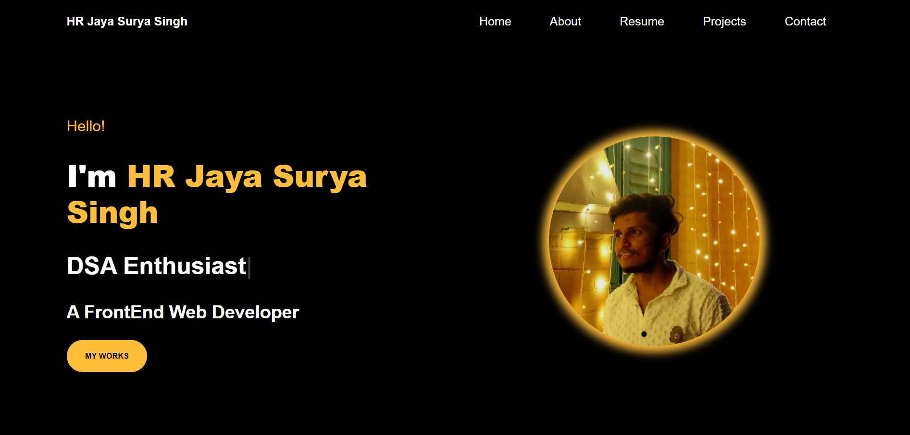

# 💼 Personal Portfolio Website



### 🌐 [Live Demo](https://hrjayasuryasingh9.github.io/FrontEnd/Personal%20Portfolio/)

This **Personal Portfolio** website showcases my professional journey, skills, and projects in a clean and interactive manner. Built with **HTML**, **CSS**, **JavaScript**, and **Bootstrap**, it highlights my web development expertise through an elegant, responsive design.

---

## ✨ Features:
- 🎨 **Modern UI/UX**: Clean and professional design, ensuring a great user experience.
- 📱 **Fully Responsive**: Optimized for both desktop and mobile platforms.
- 📜 **About Me Section**: A detailed overview of my skills, background, and interests.
- 🚀 **Projects Section**: Highlights key projects with links to live demos.
- 📧 **Contact Form**: Integrated form for users to easily get in touch.

---

## 🖥️ Live Preview:
Explore the full website here: [Live Demo](https://hrjayasuryasingh9.github.io/FrontEnd/Personal%20Portfolio/)

---

## 🛠️ How to Use:
1. **Clone** the repository:
    ```bash
    git clone https://github.com/yourusername/FrontEnd.git
    ```
2. **Open** the project folder and launch the `index.html` file in your browser to view the portfolio.

---

## 🔧 Technologies Used:
- **HTML**: Structure and content.
- **CSS**: Styling and layout.
- **JavaScript**: Interactive elements.
- **Bootstrap**: Responsive design and UI components.


---

🎯 **Looking to collaborate?** Feel free to reach out via the contact form or connect with me on LinkedIn!

---

### 🌟 [View My Portfolio](https://hrjayasuryasingh9.github.io/FrontEnd/Personal%20Portfolio/)
