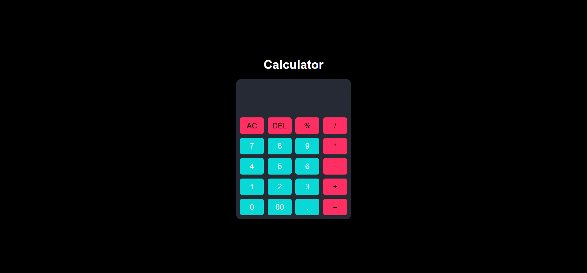

# 🌟 Frontend Projects Portfolio

Welcome to my **Frontend Projects Portfolio**! This repository showcases a collection of web development projects that demonstrate my skills in **HTML**, **CSS**, **JavaScript**, and various frontend technologies. Each project highlights different aspects of web design and development, from interactive web apps to responsive layouts.

---

## 🛠️ Projects Overview

Here are some of the standout projects included in this repository:

---

### 1. 🧮 **Calculator Web Application**

A sleek and user-friendly calculator with real-time calculations and a clean interface.

  
[**View Live Demo**](https://hrjayasuryasingh9.github.io/FrontEnd/Calculator/)

**Technologies Used:**
  

---

### 2. 💼 **Personal Portfolio Website**

My personal portfolio showcasing my skills, background, and key projects in a modern and interactive design.

  
[**View Live Demo**](https://hrjayasuryasingh9.github.io/FrontEnd/Personal%20Portfolio/)

**Technologies Used:**
   

---

### 3. 🌐 **Responsive Landing Page**

A beautifully designed landing page that adjusts seamlessly across all devices, featuring smooth animations and a minimalist layout.

  
[**View Live Demo**](https://hrjayasuryasingh9.github.io/FrontEnd/Responsive%20Landing%20Page/)

**Technologies Used:**
   

---

### 4. ⏱️ **Stopwatch Web Application**

A functional and stylish stopwatch with essential time tracking features and a responsive design.

  
[**View Live Demo**](https://hrjayasuryasingh9.github.io/FrontEnd/Stop%20Watch/)

**Technologies Used:**
  

---

### 5. 🌡️ **Temperature Converter**

A handy tool for converting temperatures between Celsius, Fahrenheit, and Kelvin, with a clean and interactive interface.

  
[**View Live Demo**](https://hrjayasuryasingh9.github.io/FrontEnd/Temparature%20Converter/)

**Technologies Used:**
  

---

### 6. ❌⭕ **Tic Tac Toe Game**

A classic Tic Tac Toe game with options for single-player and two-player modes, featuring a simple and engaging design.

  
[**View Live Demo**](https://hrjayasuryasingh9.github.io/FrontEnd/Tic%20Tac%20Toe/)

**Technologies Used:**
  

---

### 7. 📝 **Todo List Web App**

A practical todo list app to manage tasks effectively, with features for adding, editing, and deleting tasks.

  
[**View Live Demo**](https://hrjayasuryasingh9.github.io/FrontEnd/Todo%20List/)

**Technologies Used:**
  

---

### 8. 🌦️ **Weather App**

A weather application providing current conditions and forecasts for any location, designed with a user-friendly interface.

  
[**View Live Demo**](https://hrjayasuryasingh9.github.io/FrontEnd/Weather%20App/)

**Technologies Used:**
  

---

### 9. 🍃 **Organic Products Showcase**

A beautifully designed webpage to display organic products, featuring a clean layout and user-friendly interface.

  
[**View Live Demo**](https://hrjayasuryasingh9.github.io/FrontEnd/Organic%20Products/)

**Technologies Used:**
  

---

## 🚀 Technologies Used

- **HTML5**: For structuring web content.
- **CSS3**: For styling and responsive layouts.
- **JavaScript**: For dynamic interactions and functionality.
- **Bootstrap**: For responsive design and UI components.

**Icons:**
   

---

## 💡 How to Get Started

1. **Clone the Repository**:
    ```bash
    git clone https://github.com/hrjayasuryasingh9/FrontEnd.git
    ```
2. **Navigate** to the desired project folder and open `index.html` in your browser to view the project.

---

## 📬 Get in Touch

Feel free to reach out to me for any collaborations or inquiries. You can connect with me on [LinkedIn](https://www.linkedin.com/in/yourprofile) or send me an email at [your-email@example.com](mailto:your-email@example.com).

---

### 🌟 Explore and Enjoy! 🌟

Thank you for visiting my projects repository. I hope you find the projects interesting and insightful!
