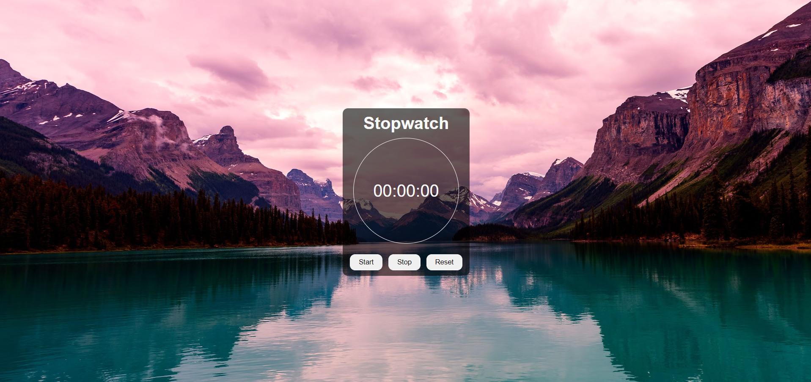

# ⏱️ Stopwatch Web Application



### 🔗 [Live Demo](https://hrjayasuryasingh9.github.io/FrontEnd/Stop%20Watch/)

This **Stopwatch Web Application** is designed for simplicity and efficiency, allowing users to measure elapsed time accurately. Built with **HTML**, **CSS**, and **JavaScript**, this lightweight and responsive app provides essential stopwatch functionalities.

---

## ✨ Features:
- 🕒 **Start, Stop, Reset**: Basic stopwatch controls for easy time tracking.
- ⏱️ **Accurate Time Measurement**: Measure hours, minutes, seconds, and milliseconds.
- 📱 **Fully Responsive**: Works smoothly across all devices, from desktops to smartphones.
- ⚡ **Minimalistic UI**: A clean and simple user interface designed for easy usability.

---

## 🛠️ How to Use:
1. **Clone the repository**:
    ```bash
    git clone https://github.com/hrjayasuryasingh9/FrontEnd.git
    ```
2. Open the project folder and launch the `index.html` file to start the stopwatch.

---

## 💻 Technologies Used:
- **HTML5**: For structuring the stopwatch.
- **CSS3**: For styling and layout.
- **JavaScript**: For adding stopwatch functionality.


---

### 🌟 [Check Out the Live Demo](https://hrjayasuryasingh9.github.io/FrontEnd/Stop%20Watch/)

Feel free to fork and customize this stopwatch for your own needs!
