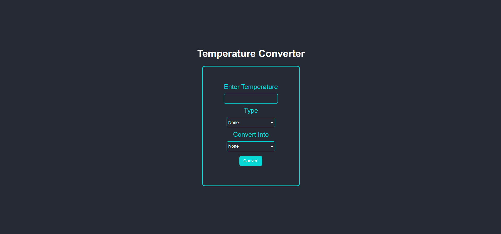

# 🌡️ Temperature Converter



### 🔗 [Live Demo](https://hrjayasuryasingh9.github.io/FrontEnd/Temparature%20Converter/)

This **Temperature Converter Web App** allows users to seamlessly convert between different temperature units (Celsius, Fahrenheit, and Kelvin). It’s an easy-to-use, fully responsive tool designed with **HTML**, **CSS**, and **JavaScript**.

---

## ✨ Features:
- 🔄 **Convert between Celsius, Fahrenheit, and Kelvin**.
- ⚡ **Instant Results**: Real-time conversion with each input.
- 📱 **Responsive Design**: Works perfectly on all screen sizes, from desktop to mobile.
- 🎨 **Simple and Clean UI**: Intuitive interface for hassle-free conversions.

---

## 🛠️ How to Use:
1. **Clone the repository**:
    ```bash
    git clone https://github.com/hrjayasuryasingh9/FrontEnd.git
    ```
2. Open the project folder and launch the `index.html` file to use the temperature converter.

---

## 💻 Technologies Used:
- **HTML5**: For structuring the application.
- **CSS3**: For styling and layout.
- **JavaScript**: For implementing the conversion logic.

---

### 🌟 [Check Out the Live Demo](https://hrjayasuryasingh9.github.io/FrontEnd/Temparature%20Converter/)
