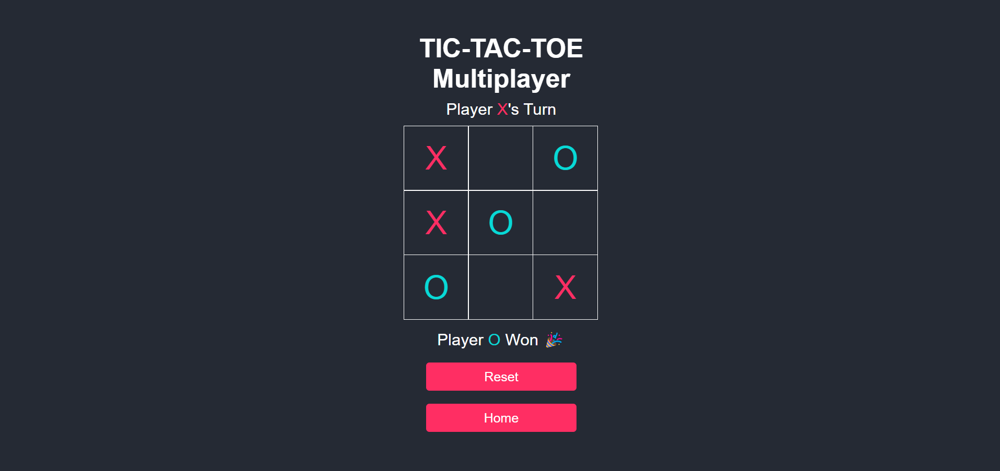

# ❌⭕ Tic Tac Toe Game



### 🔗 [Live Demo](https://hrjayasuryasingh9.github.io/FrontEnd/Tic%20Tac%20Toe/)

Enjoy a classic game of **Tic Tac Toe** built with **HTML**, **CSS**, and **JavaScript**. Challenge a friend or test your skills against the computer in this fully interactive and responsive web version of the timeless game.

---

## ✨ Features:
- 🎮 **Two-player Mode**: Play with a friend on the same device.
- 🤖 **Single-player Mode**: Play against the computer with a challenging AI.
- 💻 **Responsive Design**: Play on any device—desktop, tablet, or mobile.
- 🎨 **Simple and Clean UI**: Intuitive and easy-to-navigate interface.

---

## 🛠️ How to Use:
1. **Clone the repository**:
    ```bash
    git clone https://github.com/hrjayasuryasingh9/FrontEnd.git
    ```
2. Open the project folder and launch the `index.html` file to start playing Tic Tac Toe.

---

## 💻 Technologies Used:
- **HTML5**: For structuring the game board.
- **CSS3**: For styling and layout.
- **JavaScript**: For game logic and interactions.

---

### 🌟 [Check Out the Live Demo](https://hrjayasuryasingh9.github.io/FrontEnd/Tic%20Tac%20Toe/)
