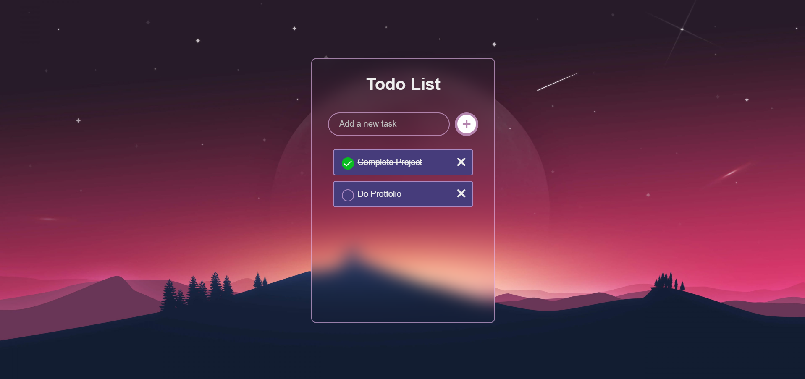

# 📝 Todo List Web App



### 🔗 [Live Demo](https://hrjayasuryasingh9.github.io/FrontEnd/Todo%20List/)

This **Todo List Web App** is designed to help users manage tasks efficiently. Built with **HTML**, **CSS**, and **JavaScript**, it offers a clean and intuitive interface, allowing users to add, edit, and remove tasks with ease.

---

## ✨ Features:
- ➕ **Add Tasks**: Quickly add new tasks to your todo list.
- ✏️ **Edit Tasks**: Modify existing tasks as needed.
- ❌ **Delete Tasks**: Remove completed or unwanted tasks.
- 📱 **Fully Responsive**: Works perfectly on all devices—desktop, tablet, and mobile.
- 🎨 **Minimalistic UI**: Clean and clutter-free interface for easy task management.

---

## 🛠️ How to Use:
1. **Clone the repository**:
    ```bash
    git clone https://github.com/hrjayasuryasingh9/FrontEnd.git
    ```
2. Open the project folder and launch the `index.html` file to start managing your tasks.

---

## 💻 Technologies Used:
- **HTML5**: For structuring the application.
- **CSS3**: For styling and layout.
- **JavaScript**: For task management logic.

---

### 🌟 [Check Out the Live Demo](https://hrjayasuryasingh9.github.io/FrontEnd/Todo%20List/)
