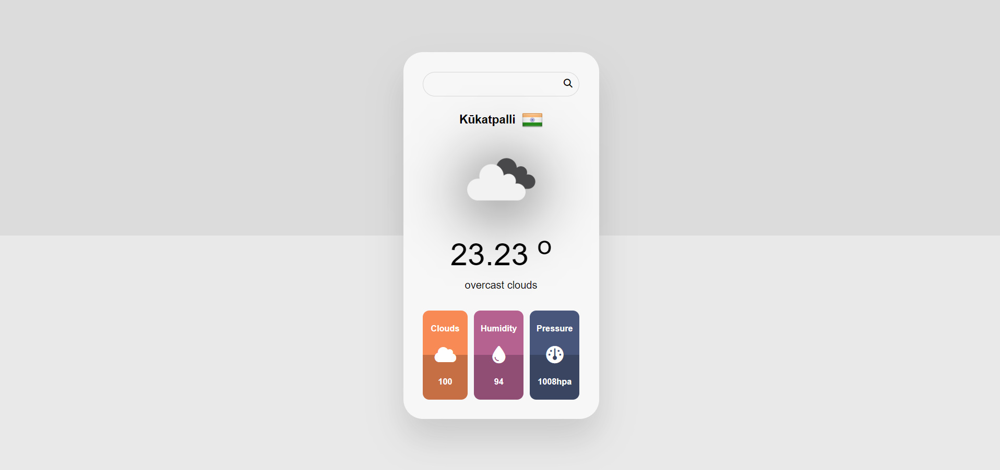

# 🌦️ Weather App



### 🔗 [Live Demo](https://hrjayasuryasingh9.github.io/FrontEnd/Weather%20App/)

Stay informed about the weather with this **Weather App** built using **HTML**, **CSS**, and **JavaScript**. It provides current weather conditions and forecasts for any location, offering a clean and user-friendly interface.

---

## ✨ Features:
- 🌍 **Search by Location**: Enter any city to get current weather and forecasts.
- 🌡️ **Current Conditions**: Displays temperature, weather conditions, and more.
- ⏳ **Forecast**: Get a 7-day weather forecast for future planning.
- 📱 **Responsive Design**: Works seamlessly on all devices, from desktop to mobile.
- 🎨 **Simple UI**: Intuitive and easy-to-use interface.

---

## 🛠️ How to Use:
1. **Clone the repository**:
    ```bash
    git clone https://github.com/hrjayasuryasingh9/FrontEnd.git
    ```
2. Open the project folder and launch the `index.html` file to start using the weather app.

---

## 💻 Technologies Used:
- **HTML5**: For structuring the weather app.
- **CSS3**: For styling and responsive design.
- **JavaScript**: For fetching weather data and handling user interactions.

---

### 🌟 [Check Out the Live Demo](https://hrjayasuryasingh9.github.io/FrontEnd/Weather%20App/)
